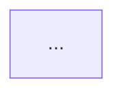

# Projekt Dijagrami - Predikcija Vremena Merge-a PR-ova

Ovaj folder sadrži Mermaid dijagrame koji vizualno prikazuju tok projekta kroz 11 faza.

## Dostupne Verzije

### 1. `project_strip.png` ⭐ **PREPORUČENO**
- **Format**: Horizontalni strip layout (LR - Left to Right)
- **Dimenzije**: 3200x800px
- **Najbolje za**: Vizualni prikaz kao stripovi, prezentacije, dokumentaciju
- **Karakteristike**: 
  - Sve faze u jednom horizontalnom redu
  - Jasne boje po grupama faza
  - Kratki opisi aktivnosti u svakoj fazi

### 2. `project_flowchart.png`
- **Format**: Standardni flowchart (LR)
- **Dimenzije**: 2400x1200px
- **Najbolje za**: Opći pregled projekta
- **Karakteristike**:
  - Kompaktniji layout
  - Start/End čvorovi
  - Boje po kategorijama faza

### 3. `project_timeline.png`
- **Format**: Vertikalni timeline (TB - Top to Bottom)
- **Dimenzije**: 2000x2800px
- **Najbolje za**: Detaljniji prikaz sa više informacija
- **Karakteristike**:
  - Vertikalni layout
  - Više detalja po fazi
  - Bolje za printanje

## Kategorije Faza (Boje)

- **Plava** (Faze 1-2): Prikupljanje i priprema podataka
- **Narančasta** (Faze 3-5): Analiza i feature selection
- **Ljubičasta** (Faze 6-8): Modeliranje i optimizacija
- **Zelena** (Faze 9-10): Napredna poboljšanja i ensemble
- **Narančasta** (Faza 11): Production sustav

## Generiranje PNG-a

Za regeneriranje PNG-a iz Mermaid fajlova:

```bash
# Instalacija dependencies (jednom)
npm install

# Generiranje strip verzije
npx mmdc -i project_strip.mmd -o project_strip.png -w 3200 -H 800 -b white

# Generiranje flowchart verzije
npx mmdc -i project_flowchart.mmd -o project_flowchart.png -w 2400 -H 1200 -b transparent

# Generiranje timeline verzije
npx mmdc -i project_timeline.mmd -o project_timeline.png -w 2000 -H 2800 -b white
```

## Izmjena Dijagrama

1. Uredi odgovarajući `.mmd` fajl
2. Pokreni `npx mmdc` komandu za regeneriranje PNG-a
3. PNG će biti automatski ažuriran

## Korištenje u Dokumentaciji

Za korištenje u Markdown dokumentaciji:

```markdown

```

ili direktno embed Mermaid koda:

````markdown

````
