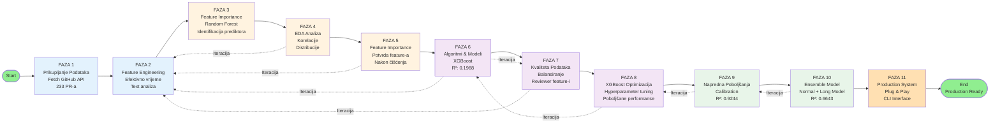

# Projekt Flowchart - Predikcija Vremena Merge-a PR-ova

```mermaid
flowchart LR
    Start([Start]) --> F1[FAZA 1<br/>Prikupljanje Podataka<br/>Fetch GitHub API<br/>233 PR-a]
    
    F1 --> F2[FAZA 2<br/>Feature Engineering<br/>Efektivno vrijeme<br/>Text analiza]
    
    F2 --> F3[FAZA 3<br/>Feature Importance<br/>Random Forest<br/>Identifikacija prediktora]
    
    F3 --> F4[FAZA 4<br/>EDA Analiza<br/>Korelacije<br/>Distribucije]
    
    F4 --> F5[FAZA 5<br/>Feature Importance<br/>Potvrda feature-a<br/>Nakon čišćenja]
    
    F5 --> F6[FAZA 6<br/>Algoritmi & Modeli<br/>XGBoost<br/>R²: 0.1988]
    
    F6 --> F7[FAZA 7<br/>Kvaliteta Podataka<br/>Balansiranje<br/>Reviewer feature-i]
    
    F7 --> F8[FAZA 8<br/>XGBoost Optimizacija<br/>Hyperparameter tuning<br/>Poboljšane performanse]
    
    F8 --> F9[FAZA 9<br/>Napredna Poboljšanja<br/>Calibration<br/>R²: 0.9244]
    
    F9 --> F10[FAZA 10<br/>Ensemble Model<br/>Normal + Long Model<br/>R²: 0.6643]
    
    F10 --> F11[FAZA 11<br/>Production System<br/>Plug & Play<br/>CLI Interface]
    
    F11 --> End([End<br/>Production Ready])

    %% Iteracije
    F4 -.->|Iteracija| F2
    F5 -.->|Iteracija| F2
    F6 -.->|Iteracija| F2
    F6 -.->|Iteracija| F7
    F7 -.->|Iteracija| F2
    F8 -.->|Iteracija| F6
    F9 -.->|Iteracija| F8
    F10 -.->|Iteracija| F9

    style Start fill:#90EE90
    style End fill:#90EE90
    style F1 fill:#E3F2FD
    style F2 fill:#E3F2FD
    style F3 fill:#FFF3E0
    style F4 fill:#FFF3E0
    style F5 fill:#FFF3E0
    style F6 fill:#F3E5F5
    style F7 fill:#F3E5F5
    style F8 fill:#F3E5F5
    style F9 fill:#E8F5E9
    style F10 fill:#E8F5E9
    style F11 fill:#FFE0B2
```
